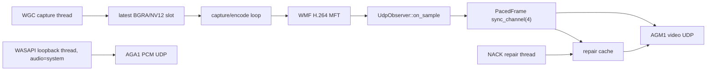
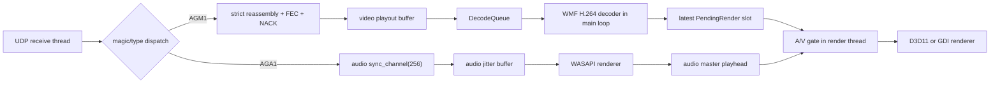

# Rust Native Media A/V Code Audit

Date: 2026-07-10

Scope: the current working tree under `rust-native/agoralink_media/src/`. This is a static code audit plus the permitted Rust build checks. It does not claim LAN, WGC, WASAPI, or GUI runtime results that were not executed during this audit.

Constraints observed:

- No Rust media source was changed for this audit.
- No Python, RUDP, chat, file-transfer, database, FFmpeg, or GUI code was changed.
- Existing uncommitted worktree changes were treated as the audit baseline and were not reverted.

## Executive Summary

The video-only runtime is structurally isolated from audio: with `--audio off`, the sender does not create a `MediaClock` or audio sender, and the receiver does not create audio ingest, WASAPI playback, an audio master, or an A/V gate. That isolation is a sound basis for protecting the known-good video path.

The current audio-on path is not ready for product-level A/V synchronization. The principal issue is not a general lock deadlock or audio parsing cost. It is that the pipeline has several incompatible definitions of time:

1. audio capture uses `MediaClock::now_us()` when the capture buffer is read, while ignoring the WASAPI QPC timestamp returned by `GetBuffer`;
2. video timestamps are assigned in the post-encode observer and are reduced from microseconds to the legacy AGM1 millisecond header;
3. the receiver audio master represents samples submitted to WASAPI, not samples audibly played after device padding;
4. receiver anchors are collected for diagnostics but are not used by the render gate; and
5. jitter-buffer overflow can remove queued media without advancing or invalidating the corresponding audio master playhead.

In addition, the current latest-frame gate can keep resetting its 80 ms hold timer whenever a newer pending frame replaces the held frame. Under a persistent early-video condition at 60 FPS, that can indefinitely defer rendering. This is still capable of recreating a `frames_rendered = 0` class failure after renderer initialization.

Recommendation: stop applying isolated timing patches. Keep the video/NACK/FEC/render path intact, but perform a small, bounded refactor of the audio timeline and A/V gate before enabling audio by default. The recommended boundary is `audio_udp.rs`, `media_clock.rs`, and the A/V section of `h264_recv_view.rs`; it does not require changing AGM1 video DATA/FEC/NACK wire format.

## Architecture Map

### `screen-send`



Relevant implementation locations:

- Capture and encode orchestration: `capture_encode_probe.rs:536-706`.
- `UdpObserver` packetization and pacing: `h264_send_probe.rs:152-452`, `h264_send_probe.rs:616-748`.
- NACK cache/re-send worker: `h264_send_probe.rs:367-381`, `h264_send_probe.rs:1007-1078`.
- WASAPI loopback and PCM packetization: `audio_udp.rs:805-1007`.

The WGC/GPU capture thread only maintains a latest-frame slot. Encoding and packetization happen in the capture/encode loop, and UDP transmission happens in the pacing worker. That decoupling is appropriate for a realtime latest-frame sender.

### `screen-recv`



Relevant implementation locations:

- Runtime construction and shutdown: `h264_recv_view.rs:489-684`.
- UDP dispatch, repair and playout: `h264_recv_view.rs:756-1040`.
- Decoder and render handoff: `h264_recv_view.rs:1201-1296`.
- Render-thread A/V gate: `h264_recv_view.rs:1299-1453`.
- Audio jitter and WASAPI playback: `audio_udp.rs:1039-1322`, `audio_udp.rs:1578-1679`.

### Audio-off versus audio-on

| Concern | `--audio off` | `--audio system/on` |
|---|---|---|
| Sender media clock | Not created | `MediaClock` created and cloned into audio sender |
| Sender audio thread | Not created | `agoralink-audio-send` starts WASAPI loopback and AGA1 send |
| Receiver media clock | Not created | Created and supplied to video observation and audio receiver |
| Receiver audio thread | Not created | `agoralink-audio-play` starts WASAPI render and jitter buffer |
| Audio ingress queue | Not created | `sync_channel::<AudioPacket>(256)` |
| A/V gate | `audio_master = None`; bypassed | Enabled only when the renderer is initialized and master returns a playhead |
| Video packet peer for NACK | Video only | Still video only; audio packets `continue` before `peer` is set |

Conclusion: the audio-off path does bypass the audio and A/V synchronization objects. This should be preserved as an explicit regression contract.

## Threading, Locks, Queues, and Lifecycle

| Runtime | Thread / loop | Shared state | Assessment |
|---|---|---|---|
| Sender | WGC capture thread | latest-frame `Arc<Mutex<SharedState>>` | Capture copies into a latest slot; it does not wait for encode/send. Good separation. |
| Sender | capture/encode loop | `UdpObserver`, encoder, latest slot | Synchronous encode and observer callback; backpressure enters through the bounded paced-frame channel. |
| Sender | UDP pacing worker | `sync_channel<PacedFrame>(4)`, `SendCounters`, repair cache | Bounded queue limits memory. It blocks the observer when full, intentionally applying latest-frame backpressure. |
| Sender | NACK repair worker | cloned UDP socket, `RepairCache` mutex, `SendCounters` mutex | No shared audio lock. Repair traffic is not coordinated with normal packet pacing. |
| Sender | integrated audio sender | private socket, WASAPI capture, stats mutex | Separate from video data socket and no video ingest lock. |
| Receiver | UDP receive thread | `DecodeQueue` mutex, network snapshot mutex, audio channel | Audio dispatch uses `try_send` plus atomics; it does not take the audio playback or master mutex. Good. |
| Receiver | main decode loop | `DecodeQueue`, decoder local, render latest slot | Decoding is serial and no decoder work happens in the UDP thread. Good. |
| Receiver | render thread | latest `PendingRender` mutex, audio master mutex | The A/V gate can throttle presentation but should not block UDP ingest. |
| Receiver | integrated audio receiver | private jitter buffer, audio stats mutex, master mutex | Playback state is local to the audio thread; it should not hold a lock while doing UDP ingest. |

Shutdown is generally orderly: receiver sets the shared stop flag, joins render then network then audio; sender stops audio, closes the paced-frame sender, joins pacing, then stops/joins repair. The network socket uses nonblocking receives and the repair socket has a 20 ms read timeout, so no indefinite blocking join is evident in the reviewed paths.

No direct lock-order inversion was found between the audio thread, video UDP ingest, and render worker. The principal concurrency risk is policy-level starvation in the render gate, not a mutex deadlock.

## Packet Dispatch and Repair Audit

### Wire families

| Traffic | Magic / representation | Destination handling |
|---|---|---|
| Video data / FEC / repair resend | `AGM1`, `MediaPacket` | Strict H.264 reassembly; repair is a resend of the original AGM1 packet. |
| Audio PCM | `AGA1`, `AudioPacket` | Detected before AGM1 parsing and sent into the bounded audio ingress channel. |
| NACK control | `NACK`, `NackPacket` | Sender repair thread receives it on a cloned video socket; receiver rejects it on the media receive socket. |

The implementation correctly avoids updating the receiver NACK peer from audio traffic: AGA1 handling returns early before the `peer = Some(source_peer)` assignment in `h264_recv_view.rs:796-832`. This protects the NACK destination when sender audio uses a distinct ephemeral source port.

The implementation also prevents AGA1 packets from entering H.264 reassembly while audio is enabled. With audio disabled, AGA1 is counted as unknown and is not sent to reassembly.

### Findings

- The audio session ID is generated independently from the video session ID, and `JitterBuffer::insert` does not validate `AudioPacket.session_id`. Any valid AGA1 packet sent to the receiver port can become the audio clock source. The video reassembler, in contrast, pins itself to the first AGM1 session. This is a reliability and session-correlation gap. See `h264_send_probe.rs:367-452`, `audio_udp.rs:1091-1116`, and `h264_reassembly.rs:454-480`.
- `IntegratedAudioIngest::accept_datagram` returns `true` for malformed AGA1 packets after classifying their magic, while only successfully decoded packets increment the audio ingress metric. Consequently network `audio_packets_received` can exceed the audio receiver's `packets_received`, with no `audio_packets_invalid` field to reconcile the difference. See `audio_udp.rs:284-303` and `h264_recv_view.rs:796-805`.
- `repair_packets_inserted` is incremented before reassembly proves that a repair packet was newly inserted. `repair_duplicate_packets` is present in the snapshots/output but is not incremented anywhere in the reviewed source. NACK tuning based on these fields can be misleading. See `h264_recv_view.rs:835-853` and `h264_recv_view.rs:1159-1189`.
- A received `NACK` control datagram increments `repair_packets_dropped_wrong_type`, even though it is control traffic rather than a mis-typed repair packet. This is a naming/telemetry issue, not evidence that audio changes have corrupted repair dispatch. See `h264_recv_view.rs:810-819`.

## Media Clock and Timestamp Semantics

### Current sender semantics

`MediaClock` is an `Instant`-relative microsecond clock. In audio-on mode, sender video and audio receive clones with the same `started_at`; this is the intended common epoch.

However, the two streams are timestamped at materially different pipeline points:

- Video gets `MediaClock::now_us()` inside `UdpObserver::on_sample`, after encoding has produced an H.264 access unit. AGM1 stores only `video_timestamp_us / 1000`. See `h264_send_probe.rs:687-710`.
- Audio gets `MediaClock::now_us()` when the WASAPI capture packet is read, then subtracts its sample duration. The `device_position` and `qpc_position` returned by `IAudioCaptureClient::GetBuffer` are not used. See `audio_udp.rs:957-990`.

Therefore the two timestamps are neither both capture timestamps nor both encode/send timestamps. They can contain different scheduling and pipeline delays. The current sender A/V delta is useful as a rough diagnostic but not a proof of media alignment.

### Current receiver semantics

The receiver creates `ReceiverMediaClockAnchor` instances for diagnostics. Video observation happens in the network thread; audio observation happens inside the jitter buffer. The anchors are not consulted by the render gate. The gate compares raw sender-derived video timestamps with the audio master and uses this computed offset:

```text
target_video_timestamp = audio_playhead_timestamp
                       + (video_playout_delay_ms - audio_jitter_buffer_ms) * 1000
```

See `h264_recv_view.rs:1043-1056` and `h264_recv_view.rs:1358-1415`.

This means `receiver_clock_anchor_us` is currently an observability field, not a playout authority. The gate does not require a verified common receiver anchor before it starts comparing timestamps.

### Audio master semantics

The recent change correctly avoids advancing the master for prebuffer and post-stream silence. `audio_master_playhead_us` also expires after 250 ms without a real media submission and temporarily invalidates after a detected discontinuity. See `audio_udp.rs:223-244` and `audio_udp.rs:1606-1641`.

This is an improvement, but `audio_playhead_timestamp_us` still represents media samples submitted to WASAPI, not the sample currently audible on the device. `WasapiRenderer` requests a 100 ms shared-mode buffer and exposes `GetCurrentPadding`, but the playhead does not account for that padding. See `audio_udp.rs:565-636`. This missing device-output latency is large relative to the stated 40-80 ms A/V target.

## Audio Jitter Buffer Audit

### Correct current behavior

- Queue depth is computed from queued PCM samples, not timestamp differences: `packets + pending_audio`. See `audio_udp.rs:1264-1287`.
- Default target is 120 ms. The overflow cap is `target + 100 ms`, so the default maximum is 220 ms. See `audio_udp.rs:1289-1301`.
- Pre-start silence is separate from a real underrun. Post-stream silence after 250 ms since the last packet also avoids incrementing real underruns. See `audio_udp.rs:1115-1184` and `audio_udp.rs:1303-1311`.
- Audio ingress has a bounded 256-packet channel and uses `try_send`, so a slow audio player cannot directly stall video packet ingest. See `audio_udp.rs:284-303`.

### Remaining correctness risk

When `trim_excess_latency` drops samples from `pending_audio`, it advances `pending_audio_timestamp_us` and decrements `pending_media_frames`, but it does not advance `playhead_timestamp_us` or set `playhead_discontinuity_pending`. The next audio submitted to WASAPI can therefore be newer than the reported master playhead by the amount dropped. A burst that triggers the 220 ms cap can make video look incorrectly early to the A/V gate. See `audio_udp.rs:1289-1340`.

The same class of issue exists at the sender: `PendingAudio` preserves only the timestamp of the first buffered byte and assumes later capture packets are perfectly contiguous. `append_bytes` and `append_silence` ignore later timestamp values. WASAPI discontinuity/timestamp-error flags are counted but do not segment or reset this timeline. See `audio_udp.rs:655-720` and `audio_udp.rs:957-1000`.

## Video A/V Gate Audit

### Correct current behavior

The first decoded frame is now allowed to reach `VideoRenderer::render_decoded` before gating. This fixes the earlier circular failure where the renderer could not initialize because the gate dropped every potential initialization frame. See `h264_recv_view.rs:1351-1357`.

The hold counter increments only for the first observation of a held `frame_id`, not for each two-millisecond polling iteration. Actual late drops increment `video_frames_dropped_for_av_sync`. This is better than the earlier loop-count statistic.

### Remaining starvation risk

The hold deadline is associated with `held_frame_id`. The render side uses a latest-frame slot. If frame N is early and held, then a later decoded frame N+1 replaces it before N reaches the 80 ms deadline, the code assigns a new `held_frame_id` and restarts the full 80 ms hold. At 60 FPS, a sustained early condition can keep replacing the held frame every ~16.7 ms and prevent any frame from reaching the renderer indefinitely.

This is a P0-level structural risk because it can still produce `frames_decoded > 0` with `frames_rendered = 0`, even though renderer initialization itself has been fixed. See `h264_recv_view.rs:1344-1423` and `h264_recv_view.rs:1455-1462`.

The gate also does not check the receiver anchor. It only checks whether `audio_master_playhead_us` returns a value. The `video_sync_gating_enabled` field therefore means "the current frame saw an initialized renderer and readable master", not "the receiver has a stable A/V mapping".

## NACK, Reassembly, and Playout Deadline Audit

The strict decode gate, damaged-GOP tracker, parameter-set repair, and playout buffer are materially separated from audio state. The audio-on receiver uses the same `playout_delay_ms`, NACK delay/repeat, reassembly timeout, and decode queue behavior as audio-off. Audio code does not mutate repair deadlines or reassembly state.

Good properties:

- Reassembly is strict by `frame_id`; it waits for an earlier incomplete frame and marks a gap damaged after the reorder window. See `h264_reassembly.rs:748-835`.
- FEC recovery runs before incomplete frames are expired.
- Damaged GOP recovery discards non-IDR frames until a complete IDR with parameter sets can be supplied. See `h264_reassembly.rs:140-245`.
- NACK collection suppresses progressing frames, limits per-frame requests, and has per-item repeat suppression. See `h264_reassembly.rs:399-451`.
- The receiver uses the video peer for NACK and passes `playout_delay_ms` to the repair window regardless of audio mode. See `h264_recv_view.rs:916-967`.

Risk remaining: normal paced packets and repair packets are written concurrently from separate threads through cloned UDP sockets. Repair is intentionally low-latency but is not coordinated with batch pacing. Under burst loss, repair can add micro-bursts and compete with normal frames. This is not caused by audio and does not show a lock issue, but it is a throughput/latency trade-off that should remain visible in repair telemetry.

## Statistics Reliability

| Field | Current calculation | Assessment |
|---|---|---|
| `render_output_fps` | `frames_rendered` delta divided by JSON interval | Reliable periodic presentation throughput. It is not an "active" FPS that excludes startup, gating, or shutdown. |
| `active_render_fps` | Not implemented | Needed if product diagnostics want FPS during active presentation only. |
| `audio_jitter_buffer_ms_current` | Queued PCM sample frames | Reliable primary depth field. |
| `audio_jitter_buffer_ms_avg/max` | Arithmetic average/max of depth at insert/start/fill events | Useful trend, but not a time-weighted depth average. Burst packet inserts can bias the average. |
| `audio_real_underruns` | One count per real output fill with missing data before post-stream timeout | Semantically reasonable callback-level counter. |
| `audio_silence_filled_frames` | Packet-loss concealment zero frames plus direct pre/start/post/underflow zeros | Broad aggregate; it should not be interpreted as only device underflow silence. |
| `audio_samples_rendered_total` | All WASAPI submitted frames, including silence | Name implies media playback; retain only if documented as device submissions. |
| `audio_media_samples_rendered_total` | Submitted media-timeline frames | Better source for media playhead diagnostics. |
| `audio_playhead_timestamp_us` | Media timeline submitted to WASAPI; not hardware-audible time | Not sufficient as a final audio-master clock until device padding is modeled. |
| `latest_audio_packet_timestamp_us` | Latest accepted packet timestamp | Valid ingress marker, but must not be compared as an exact queue depth. |
| `av_sync_offset_ms_avg/max` | Raw video timestamp minus computed target timestamp, sampled only when gate is active | Not a measured speaker-to-screen offset. Treat as gate-decision telemetry. |
| `video_frames_held_for_av_sync` | First hold per currently pending frame ID | Better than loop count, but latest-slot replacement can still restart holds. |
| `video_frames_dropped_for_av_sync` | Actual late-drop branch count | Reliable for that branch; does not include latest-slot replacement drops. |
| `repair_packets_inserted` | Requested packet arrived while its frame is inflight | Overstates successful new reassembly insertion. |
| `repair_duplicate_packets` | Declared/output, no increment site found | Currently unreliable; it remains zero. |
| `render_buffer_reused`, `frames_render_skipped`, `frames_decoded_not_rendered`, `decoded_frame_queue_drops` | All populated from `frames_replaced` | Four names describe one latest-slot replacement counter and should not be presented as independent signals. |

## Findings by Severity

### P0

1. **Latest-frame A/V hold can restart forever under sustained early video.**
   The 80 ms maximum hold is scoped to `held_frame_id`, while the input is a replacing latest-frame slot. A fresh frame can reset the hold before it expires at 60 FPS, resulting in no render despite continued decode. `h264_recv_view.rs:1344-1423`.

### P1

1. **Audio and video timestamps are assigned at different pipeline stages.**
   Audio is timestamped at capture-buffer processing time; video at post-encode observer time. This makes a precise A/V gate impossible without a deliberate timing contract. `audio_udp.rs:957-990`, `h264_send_probe.rs:687-710`.
2. **WASAPI QPC/device timestamps are ignored.**
   `GetBuffer` exposes `device_position` and `qpc_position`, but both are unused for the sender media timestamp. The current audio timestamp can inherit thread scheduling jitter. `audio_udp.rs:957-1000`.
3. **Audio master represents submitted, not audible, media time.**
   The 100 ms render client buffer/padding is not included in the master. A/V gate decisions can be off by device queue latency even when jitter depth looks correct. `audio_udp.rs:565-636`, `audio_udp.rs:1606-1641`.
4. **Jitter overflow can desynchronize the audio master.**
   Dropping old pending audio advances only the pending timestamp, not the playhead or discontinuity state. `audio_udp.rs:1289-1340`.
5. **`PendingAudio` assumes contiguous callback timestamps.**
   Capture discontinuity/timestamp errors are counted but do not split or reset the buffered audio timeline. `audio_udp.rs:655-720`, `audio_udp.rs:991-997`.
6. **Audio session is not correlated with video session.**
   The sender creates an independent audio session ID and the receiver accepts any AGA1 session. Foreign/stale audio can control the A/V master. `h264_send_probe.rs:367-452`, `audio_udp.rs:1091-1116`.
7. **Live decoder is configured at 30 FPS for all streams.**
   `h264_recv_view.rs` initializes `WmfH264Decoder` with `DECODER_FPS = 30`, and the decoder supplies synthetic sample times from frame index. 60 FPS streams therefore get a conflicting Media Foundation type/timing declaration. `h264_recv_view.rs:91-92`, `h264_recv_view.rs:1201-1273`, `wmf_h264_decoder.rs:107-174`.

### P2

1. **Receiver anchors are diagnostic-only.** They are reported but not used by the gate. This is confusing because field names imply a functional mapping. `media_clock.rs:33-87`, `h264_recv_view.rs:1043-1056`.
2. **Repair statistics are partly mislabeled or incomplete.** `repair_packets_inserted` is pre-reassembly, `repair_duplicate_packets` is never incremented, and NACK-control traffic increments `repair_packets_dropped_wrong_type`. `h264_recv_view.rs:810-853`.
3. **Several render counters are aliases for the same latest-slot replacement count.** They should be consolidated or renamed. `h264_recv_view.rs:1464-1482`.
4. **Audio packet parse failures cannot be reconciled in JSON telemetry.** Add `audio_packets_invalid` or distinguish magic-classified from decoded packets. `audio_udp.rs:284-303`.
5. **Thread creation failure is silently represented by `Option::ok()`.** Sender/receiver audio threads then have no worker but can initially appear enabled until an error/status is observed. `audio_udp.rs:818-838`, `audio_udp.rs:1540-1571`.
6. **Packet decoders accept trailing bytes.** Both AGM1 and AGA1 validate that declared payload fits, but do not require datagram length to equal header plus payload. This is a minor robustness issue for an unauthenticated LAN probe protocol. `main.rs:83-128`, `audio_udp.rs:84-124`.

## Recommended Minimal Refactor Boundary

Do not rewrite the capture/encode, UDP FEC/NACK, WMF decoder, D3D11 renderer, or GUI path. The smallest useful boundary is:

1. `media_clock.rs`: define sender capture/encode timestamp policy and a receiver mapping state with explicit validity and reset reasons.
2. `audio_udp.rs`: make `PendingAudio` discontinuity-aware; make jitter trim return a timeline-discontinuity event; expose device padding and distinguish submitted versus audible timestamps.
3. `h264_recv_view.rs`: replace the ad hoc latest-frame hold with an A/V scheduler whose maximum wait is tied to a clock state, not reset by every replacement; disable the gate cleanly when the clock is unstable.

No video DATA/FEC/NACK wire change is required for the first refactor. The legacy AGM1 timestamp remains milliseconds, so the first milestone should accept millisecond video precision and avoid claiming sub-millisecond synchronization. A future A/V-specific extended header can add video microseconds only after the scheduler is stable.

## Recommended Execution Order and Acceptance Criteria

### 1. Freeze video-only behavior

Keep `--audio off` exactly as today. Add only tests/assertions in a future change that verify no audio sender, receiver, master, ingress channel, or gate exists in this mode.

Acceptance:

- `audio_enabled=false`, `audio_thread_started=false`, `audio_playback_started=false`, `video_sync_gating_enabled=false`.
- Same 1080p60 NACK test has no audio-related packet dispatch or repair changes.
- `cargo fmt -- --check`
- `cargo check --locked --offline --jobs 1`
- `cargo run --locked --offline -- self-test`

### 2. Stabilize audio-only timeline

Use WASAPI capture timing consistently, preserve or explicitly repair capture discontinuities, enforce an expected audio session, and make queue trimming produce an explicit timeline reset. Do not enable the video gate in this step.

Acceptance:

- `audio_jitter_buffer_ms_current` is based on queued PCM samples.
- Default 120 ms target stabilizes in the configured range and does not drift beyond the cap without an explicit drop/reset count.
- `audio_real_underruns` excludes prebuffer and post-stream silence.
- `audio_playhead_timestamp_us` cannot move forward during pre-start or post-stream device silence.
- Audio-only sender/receiver manual check uses `audio-send` and `audio-recv-play`; no LAN result should be claimed until run by a real machine.

### 3. Establish a real audio playhead

Define separate `submitted_media_ts` and `audible_media_ts`. Update the latter from WASAPI padding/device position. Make master validity depend on prebuffer complete, known session, non-stale media, and no unresolved timeline discontinuity.

Acceptance:

- Device padding and derived audio latency are emitted in stats.
- A test can show that an injected 100 ms device queue changes audible time but not submitted time.
- A timestamp gap or trim causes a named resync state rather than a silently stale master.

### 4. Re-enable A/V gate with a bounded scheduler

Gate only after renderer initialization and a stable audio master. Use one deadline that is not reset whenever a later pending frame replaces the current latest slot. When the clock is invalid or jumps, use video-only presentation temporarily. On sustained early video, release a bounded latest frame rather than holding forever.

Acceptance:

- `frames_decoded > 0` must lead to `frames_rendered > 0` after first renderer initialization.
- `video_frames_held_for_av_sync` counts frames, not polling loops, and cannot grow indefinitely while presentation is zero.
- `video_frames_dropped_for_av_sync` records only deliberate late drops.
- A/V gate states are explicit: `disabled`, `waiting_for_audio_anchor`, `waiting_for_renderer`, `active`, and `temporarily_bypassed`.

### 5. Re-test repair and only then expose GUI audio

Run the existing video-only and audio-on command paths separately. Compare NACK data/repair counters, not just rendered FPS. Do not attach GUI behavior until native `screen-send` and `screen-recv` establish stable command-line behavior.

Acceptance metrics for audio-on are targets, not results asserted by this audit:

- `audio_jitter_buffer_ms_avg`: 80-180 ms at the default 120 ms target.
- `audio_jitter_buffer_ms_max`: no persistent value above 250 ms.
- `av_sync_offset_ms_avg`: under 80 ms initially, then under 40 ms after device-padding timing is implemented.
- `video_frames_held_for_av_sync`: proportional to actual timing corrections, never polling-loop scale.
- `frames_rendered`: close to the audio-off baseline for the same video parameters.
- `decoder_errors`: 0 under a healthy LAN stream.

## Field Keep/Rename/Delete Plan

Keep:

- `audio_jitter_buffer_ms_current`, `audio_jitter_buffer_ms_avg`, `audio_jitter_buffer_ms_max`, `audio_jitter_buffer_target_ms`.
- `audio_real_underruns`, `audio_prestart_silence_frames`, `audio_poststream_silence_frames`, `audio_media_samples_rendered_total`.
- `audio_playhead_valid`, `audio_playhead_discontinuities`, `av_sync_state`, `video_sync_gating_enabled`.
- `frames_complete`, `frames_decoded`, `frames_rendered`, damaged-GOP, FEC, NACK, and repair deadline metrics.

Rename or split:

- `audio_samples_rendered_total` -> `audio_device_frames_submitted_total`.
- `audio_silence_filled_frames` -> retain as aggregate only if accompanied by explicit `packet_loss_concealment_frames`, `prestart`, `poststream`, and `device-underflow` fields.
- `audio_callback_empty_polls` -> `audio_prebuffer_callbacks_without_media` if it remains only a pre-start event.
- `repair_packets_inserted` -> `repair_packets_matched_inflight` until actual post-reassembly insertion is counted.
- `repair_packets_dropped_wrong_type` -> `nack_control_packets_on_media_socket` for the current behavior.
- `render_buffer_reused` / `decoded_frame_queue_drops` / `frames_render_skipped` / `frames_decoded_not_rendered` -> one canonical `render_latest_slot_replacements`, plus a separate intentional AV-drop counter.

Remove after compatibility deprecation:

- `audio_underruns` alias of `audio_real_underruns`.
- `audio_output_underruns` alias in standalone audio stats.
- `render_thread_fps` if it remains an exact alias of `render_output_fps`.

## Audit Conclusion

The appropriate next move is a small audio/playhead/A/V-gate refactor, not a broad media rewrite and not more isolated threshold tuning. Video-only should remain untouched except for regression coverage. Audio-only should be made timeline-correct before the A/V gate is allowed to influence renderer throughput. NACK/FEC/reassembly and the D3D11 renderer are not the primary causes of the reported audio-on regressions in the current code.
